# 💫 Jay (Schryzon)
I'm a passionate Cloud, DevOps, and Backend enthusiast currently studying at **Universitas Mataram**, Indonesia. 

Currently have over **5 years of experience** (professional & non-professional combined) in Information Technology.

That means I've been in IT since I was 13, hehe... how time flies.

<p align="center">
  <strong>Approved by:</strong>
  <br/><br/>
  <a href="https://top.gg/bot/957471338577166417">
    
  </a>
  <a href="https://discord.com/application-directory/957471338577166417">
    
  </a>
  <a href="https://g.dev/Jayananda">
    
  </a>
</p>

```python
"Meow, love Networking."
 - Schryzon, 2026
```

# 💻 Tech Stack:
<p align="center">
  <!-- Languages / Runtimes -->
  
  
  
  
  

  <!-- Databases / Backend -->
  
  

  <!-- Storage / Services -->
  
  

  <!-- Deployment / Tools -->
  
  
  
  

  <!-- Frameworks / Libraries -->
  
  
  
  
</p>

# 📊 GitHub Stats:
<p align="center">
  
</p>

<div style="display: flex; justify-content: center; align-items: center;">
    
</div>

<p align="center">
  
</p>

## 🏆 GitHub Trophies
<p align="center">
  
</p>

### 🔝 Top Contributed Repo
<p align="center">
  
</p>

<p align="center">꧁Ieͣnͫgineer༒꧂</p>

<!---
What could "Schryzon" mean?
I don't know...
but it certainly sounds cool,
and unique!
zd
--->
